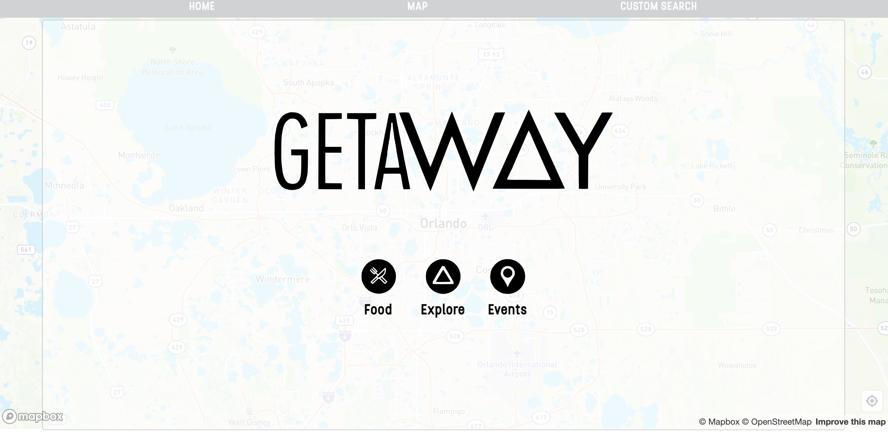
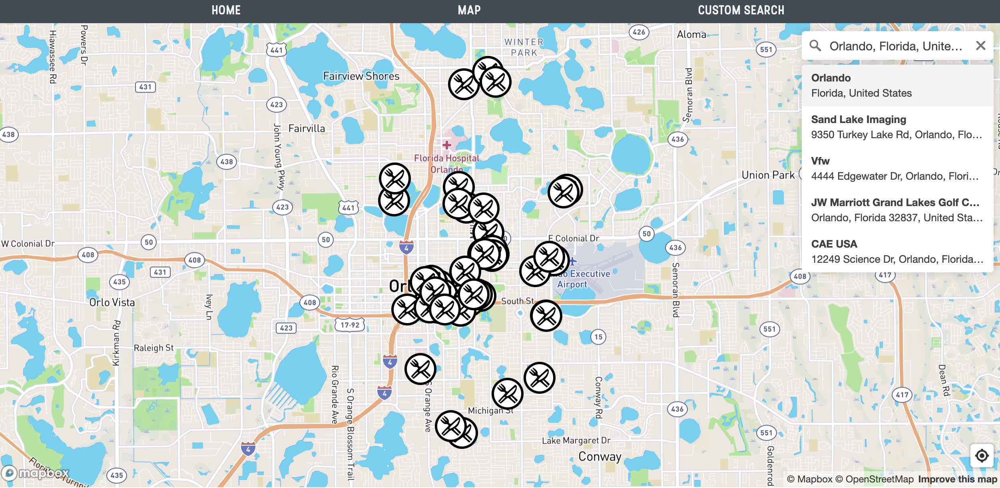
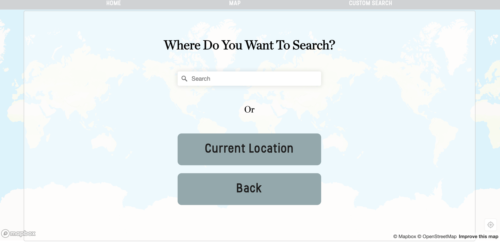
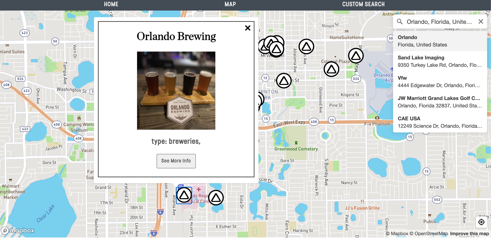
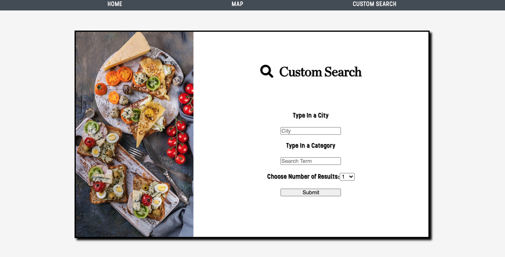
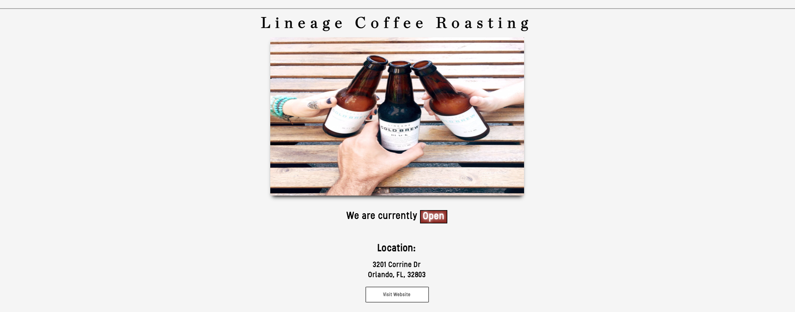

# GETAW&#x25B5;Y

The ideal app for travelers and locals! Getaway is a quick and easy way to find a great local eatery, local hot spot, or a fun event around the corner. Currently all data is being pulled from the Yelp Api.

## Motivation
I have always been inspired to make an application that focuses on locating great local things to do. The best way to find cool new spots is to see what others have said about it. This is an early release, however the goal is to add a lot more features that really make this application stand out. 

## Build Status
The application is currently in an early release. All search data is being received through the Yelp Api. One future feature that will really make this application stand out, is the planned release of a routing feature. The user will be asked how long they want to explore for (15 minutes, 30 minutes, 1 hour). Then the application will match the user with local events, restaurants, bars, parks, etc. that they can explore for their selected time. Using the power of Mapbox routing, the application will give them the best route to hit the best spots in the alloted time.

## Tech/framework used
This application was built using react. The dependencies are as follows:
- Material-ui: https://material-ui.com/
- React-map-gl: https://visgl.github.io/react-map-gl/
- React-map-gl-geocoder: https://github.com/SamSamskies/react-map-gl-geocoder
- React-mapbox-gl-geocoder: https://www.npmjs.com/package/react-mapbox-gl-geocoder
- React-modal: https://www.npmjs.com/package/react-modal
- React-loader-spinner: https://www.npmjs.com/package/react-loader-spinner
- Font awesome: https://fontawesome.com/

The APIs for this application are:
- Yelp Fusion API: https://www.yelp.com/fusion
- Mapbox: https://www.mapbox.com/

## Features
Currently the user has the option of searching using three pre selected categories or using a custom search. 

The three categories are food, explore, and events. The explore categories filters by the following categories:
- Axethrowing
- Beach Volleyball
- Beaches
- Bungee Jumping
- Climbing
- Escape games
- Experiences
- Hiking
- Rock Climbing
- Sailing
- Skiing
- Snorkeling
- Arcades
- Gardens
- Outdoor Movies
- Festivals
- Jazz and blues
- Art Museums
- Wineries
- Hot Springs
- Tasting Classes
- Breweries
- Coffee
- Food Trucks
- Street Vendors
- Tea
- Beer Tours
- Local Flavor
- Bars
- Beer Gardens

## Installation
The application is fully accessable through the browser. If interested, the code can be forked and cloned. Be sure to include the listed dependecies. 

## Credits
- Leigh Halliday https://www.youtube.com/user/leighhalliday For inspiration and video on mapbox usage
- Alejandra Gomez for help with graphics for the logos
- https://freefrontend.com/ for ideas and help with styling buttons and components

## License
&copy; tjconti12

